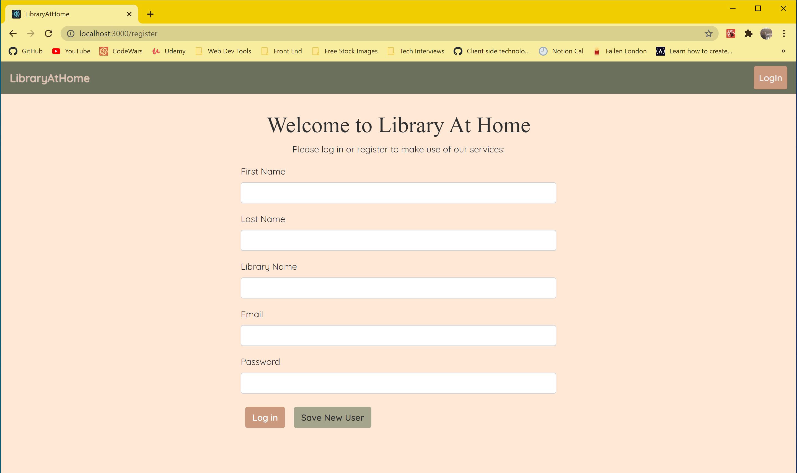
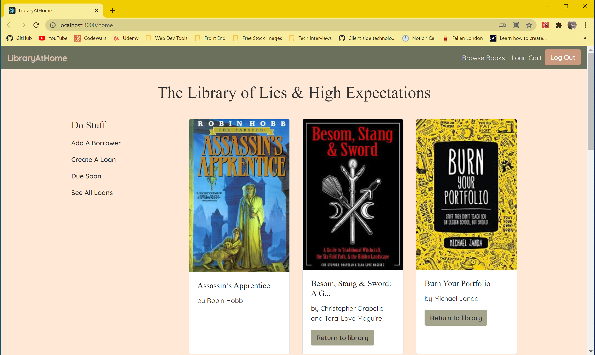
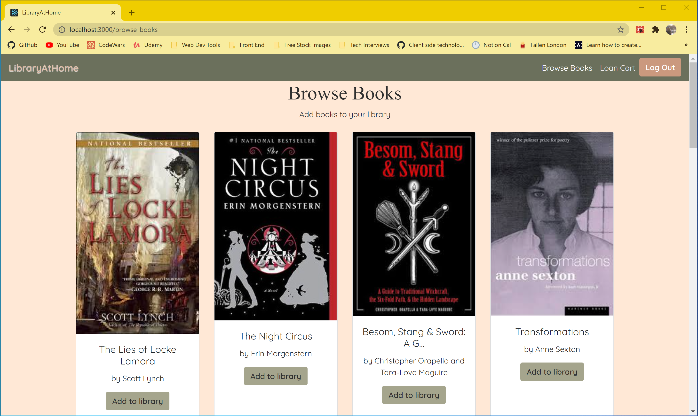
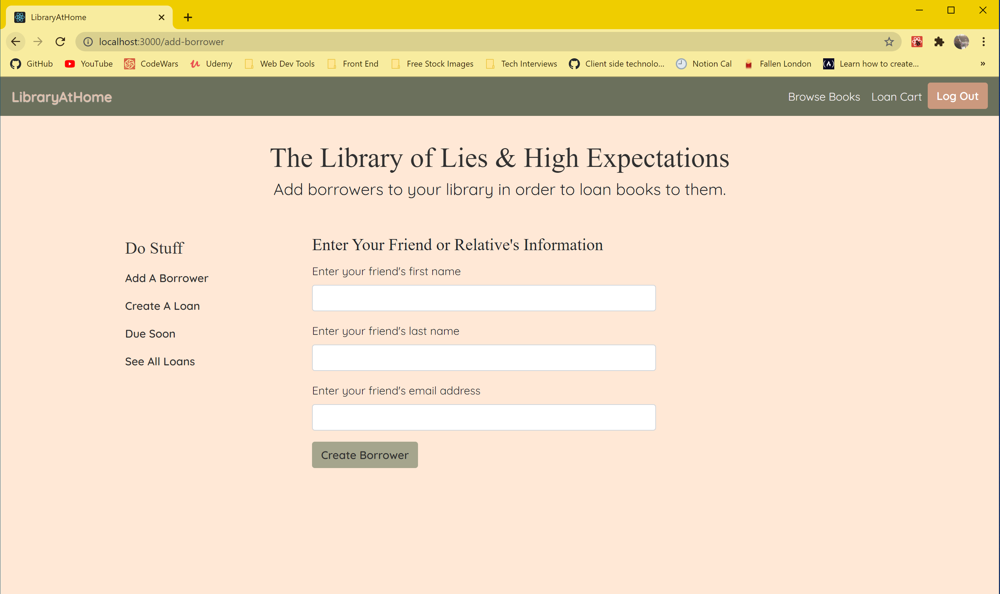
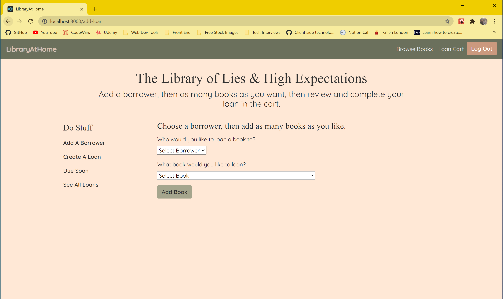
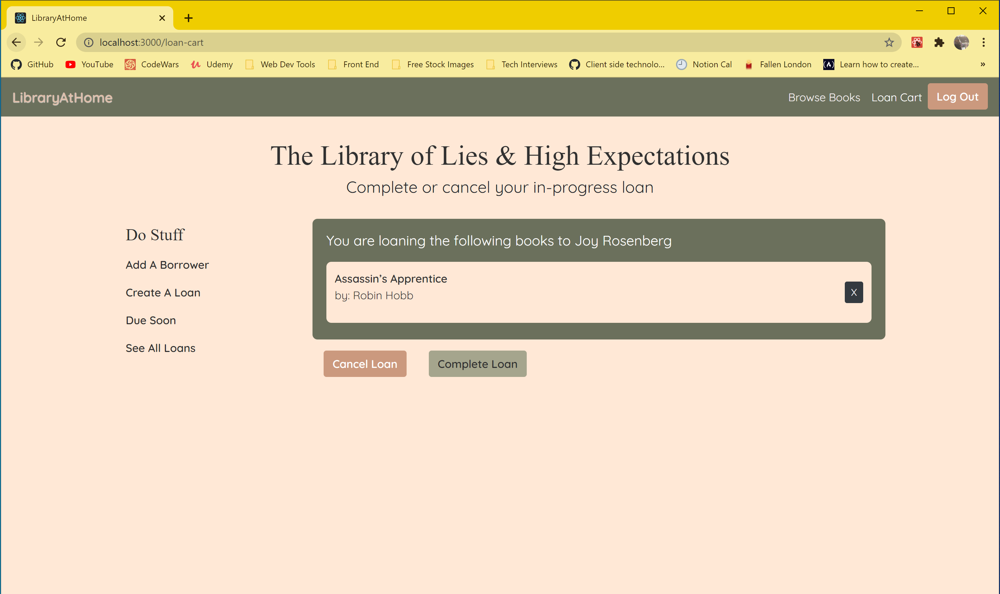
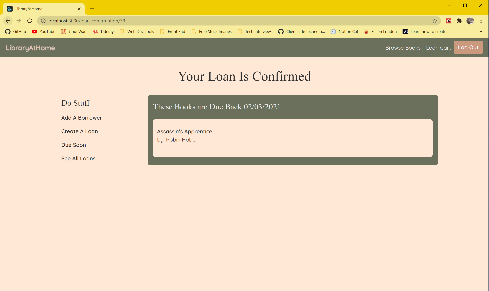
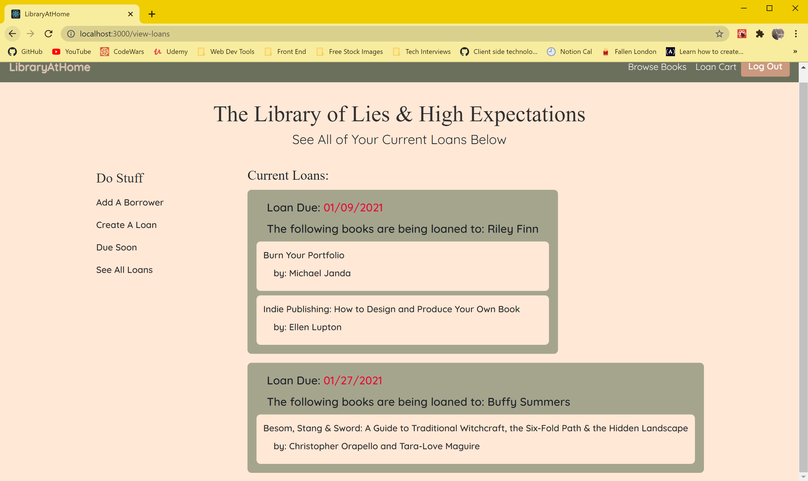

# LibraryAtHome

## Description
LibraryAtHome allows a user to track the books they own, to whom those books are loaned, and when the user can expect them to be returned. It is for book enthusiasts who love to share their passion for the written word on the printed page.

## Screenshots

